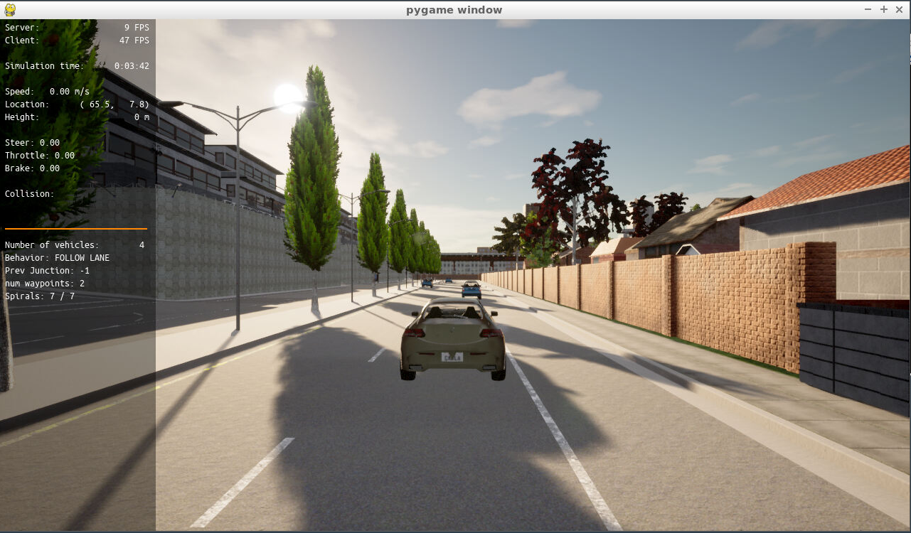
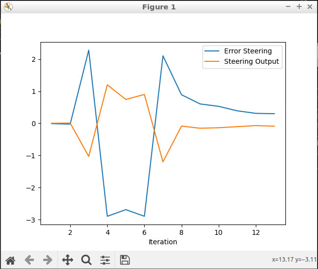
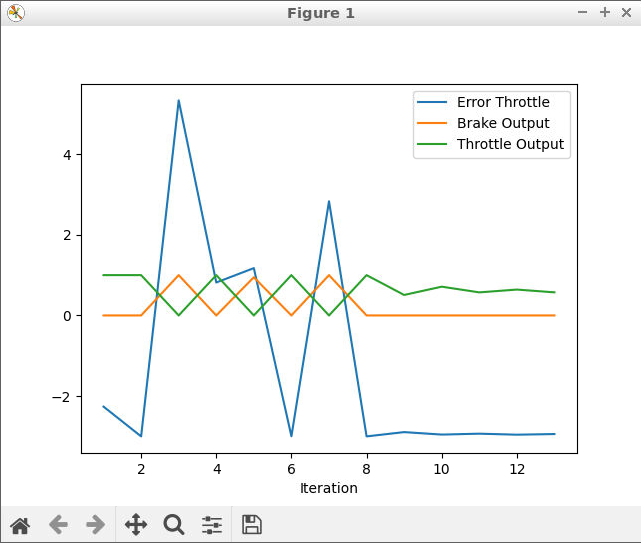

# Control and Trajectory Tracking for Autonomous Vehicle

# Proportional-Integral-Derivative (PID)

In this project, a PID controller was created and tested with the Carla Simulator.

## Project Steps

Initially test compile was made for the empty PID controller to check if the environment is fine. And it was observed that the car was not moving as no controller was installed. 

### Step 1: Build the PID controller object
- The pid_controller.h was initiated with public variables to hold errors, co-efficients and time.
- The pid_controller.cpp was populated with the relevant codes on the defined functions of Init, UpdateError, TotalError, and UpdateDeltaTime.
- The PID controller object was built without any errors

Run the simulator and see in the desktop mode the car in the CARLA simulator. Take a screenshot and add it to your report. The car should not move in the simulation.

### Step 2: PID controller for throttle:
In main.cpp, the throttle was calculated from the available velocity of the car and the minimum of the desired velocity. This way the throttle error can be sent to calculate the total error. An check is made if the value is with in the min-max range and the throttle is set to the car.

### Step 3: PID controller for steer:
In main.cpp, the steer was calculated based on the yaw angle. The in-built angle_between_points is used to calculate the required angle. It is then corrected with the actual yaw of the vehicle and steer error is calculated. Similar to the throttle control, the total error is calculated and made sure that it is within the min-max range.

### Step 4: Evaluate the PID efficiency
Initially, the Car didn't follow the path as predicted. It got hit at the wall. The steer error was especially too high and this happened. 

! (https://github.com/Arunaachalam/ControlAndTrajectoryTracking/blob/main/img/Firstrun.MP4)

It can be seen that the steer error was ranging between -2 to 3 and Throttle error was ranging between -2 and 4.

To reduce the errors an iteration of changing the Kp,Ki,Kd values are made to identify a better solution.

Answer the following questions:
- Add the plots to your report and explain them (describe what you see)
- What is the effect of the PID according to the plots, how each part of the PID affects the control command?
- How would you design a way to automatically tune the PID parameters?
- PID controller is a model free controller, i.e. it does not use a model of the car. Could you explain the pros and cons of this type of controller?
- (Optional) What would you do to improve the PID controller?

### Tips:

- When you wil be testing your c++ code, restart the Carla simulator to remove the former car from the simulation.
- If the simulation freezes on the desktop mode but is still running on the terminal, close the desktop and restart it.
- When you will be tuning the PID parameters, try between those values:

