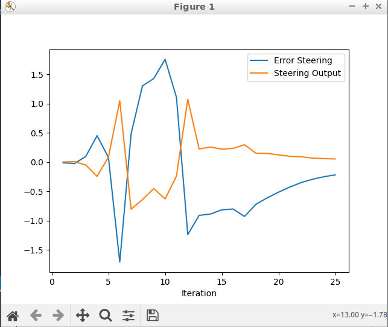
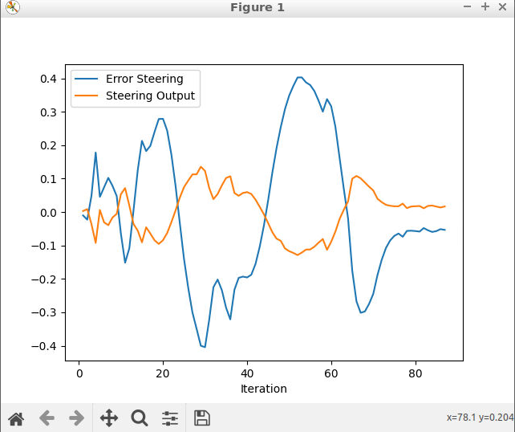
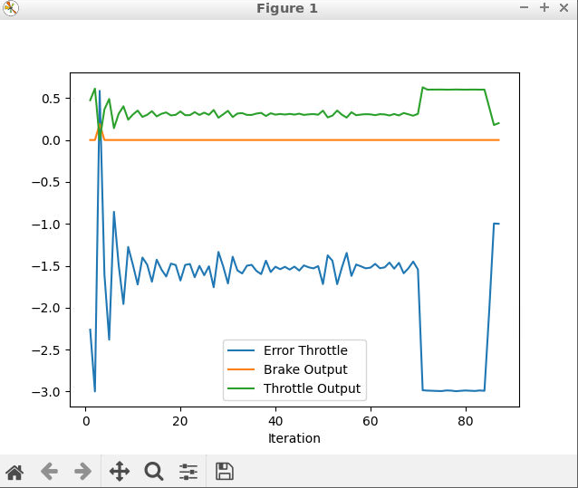
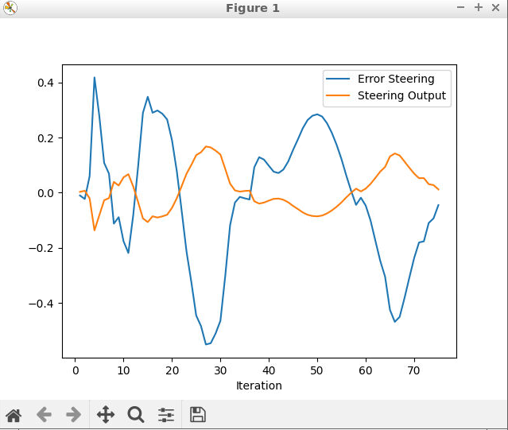

# Control and Trajectory Tracking for Autonomous Vehicle

# Proportional-Integral-Derivative (PID)

In this project, a PID controller was created and tested with the Carla Simulator.

## Project Steps

Initially test compile was made for the empty PID controller to check if the environment is fine. And it was observed that the car was not moving as no controller was installed. 

### Step 1: Build the PID controller object
- The pid_controller.h was initiated with public variables to hold errors, co-efficients and time.
- The pid_controller.cpp was populated with the relevant codes on the defined functions of Init, UpdateError, TotalError, and UpdateDeltaTime.
- The PID controller object was built without any errors

Run the simulator and see in the desktop mode the car in the CARLA simulator. Take a screenshot and add it to your report. The car should not move in the simulation.

### Step 2: PID controller for throttle:
In main.cpp, the throttle was calculated from the available velocity of the car and the minimum of the desired velocity. This way the throttle error can be sent to calculate the total error. An check is made if the value is with in the min-max range and the throttle is set to the car.

### Step 3: PID controller for steer:
In main.cpp, the steer was calculated based on the yaw angle. The in-built angle_between_points is used to calculate the required angle. It is then corrected with the actual yaw of the vehicle and steer error is calculated. Similar to the throttle control, the total error is calculated and made sure that it is within the min-max range.

### Step 4: Evaluate the PID efficiency
Initially, the Car didn't follow the path as predicted. It got hit at the wall. The steer error was especially too high and this happened. 

It can be seen that the steer error was ranging between -2 to 3 and Throttle error was ranging between -2 and 4.

To reduce the errors an iteration of changing the Kp,Ki,Kd values are made to identify a better solution.

The second iteration resulted in an oscillating car, but this is still an better improvement. A better improvementon steer error now between -1.5 to 1.5 and throttle error is still peaky.

The third iteration results are better with good steering capability, but the speed of the car was very low.

The fourth iteration I tried to increase the speed of the car by playing with the co-efficients and obtained a better speed.

The co-efficients are used for fine tuning each iterations

| Iteration | Steer           | Throttle         |
| First     | 0.3, 1e-3, 0.3  | 0.2, 1e-3, 2     |
| Second    | 0.3, 1e-3, 0.3  | 0.2, 1e-3, 0.2   |
| Third     | 0.3, 1e-3, 0.3  | 0.2, 1e-3, 0.02  |
| Fourth    | 0.3, 1e-3, 0.03 | 0.2, 1e-3, 0.02  |

### Step 5: Further comments
The PID controller is independent of the car model, for example the speed-torque characteristics of the car is not defined anywhere, only by applying a throttle, it is difficult to define the actual acceleration outcome of the car. It has to be included to make the car throttle smoothly.

A better way to control is to design an automated PID parameter control. This can be done by, for example Twiddle, by tweaking the steer and throttle parameters.

Though this is an implementation, it has to be improved to have better throttle characteristics. This can be improved by adding a car model to the throttle and adjust the parameters with a Twiddle algorithm.